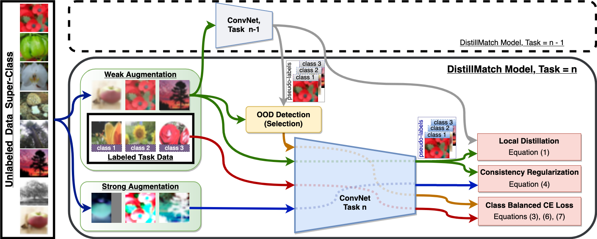

## (Coming Early May 2021) Memory-Efficient Semi-Supervised Continual Learning: The World is its Own Replay Buffer
PyTorch code for the IJCNN'21 paper (Coming Early May 2021):\
**Memory-Efficient Semi-Supervised Continual Learning: The World is its Own Replay Buffer**\
**_[James Smith]_**, [Jonathan Balloch], Yen-Chang Hsu, [Zsolt Kira]\
International Joint Conference on Neural Networks (IJCNN), 2021\
[[arXiv]]

## Abstract

Rehearsal is a critical component for class-incremental continual learning, yet it requires a substantial memory budget. Our work investigates whether we can significantly reduce this memory budget by leveraging unlabeled data from an agent's environment in a realistic and challenging continual learning paradigm. Specifically, we explore and formalize a novel semi-supervised continual learning (SSCL) setting, where labeled data is scarce yet non-i.i.d. unlabeled data from the agent's environment is plentiful. Importantly, data distributions in the SSCL setting are realistic and therefore reflect object class correlations between, and among, the labeled and unlabeled data distributions. We show that a strategy built on pseudo-labeling, consistency regularization, Out-of-Distribution (OoD) detection, and knowledge distillation reduces forgetting in this setting. Our approach, DistillMatch, increases performance over the state-of-the-art by no less than 8.7\% average task accuracy and up to 54.5\% average task accuracy in SSCL CIFAR-100 experiments. Moreover, we demonstrate that DistillMatch can save up to 0.23 stored images per processed unlabeled image compared to the next best method which only saves 0.08. Our results suggest that focusing on realistic correlated distributions is a significantly new perspective, which accentuates the importance of leveraging the world's structure as a continual learning strategy.

## Acknowledgement
This work is partially supported by both the Lifelong Learning Machines (L2M) program of DARPA/MTO: Cooperative Agreement HR0011-18-2-0019 and Samsung Research America.

## Citation
If you found our work useful for your research, please cite our work:
    @article{smith2021memory,
      title={Memory-Efficient Semi-Supervised Continual Learning: The World is its Own Replay Buffer},
      author={Smith, James and Balloch, Jonathan and Hsu, Yen-Chang and Kira, Zsolt},
      journal={arXiv preprint arXiv:2101.09536},
      year={2021}
    }

And also consider citing the framework in which our repo is built upon:
    @article{hsu2018re,
      title={Re-evaluating continual learning scenarios: A categorization and case for strong baselines},
      author={Hsu, Yen-Chang and Liu, Yen-Cheng and Ramasamy, Anita and Kira, Zsolt},
      journal={arXiv preprint arXiv:1810.12488},
      year={2018}
    }

[James Smith]: https://jamessealesmith.github.io/
[Jonathan Balloch]: https://jballoch.com/
[Zsolt Kira]: https://www.cc.gatech.edu/~zk15/
[arXiv]: https://arxiv.org/abs/2101.09536
