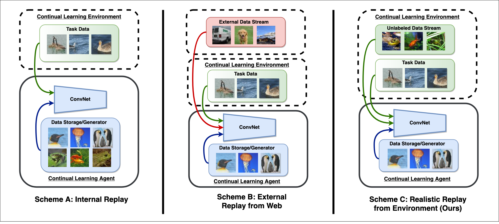

## Memory-Efficient Semi-Supervised Continual Learning: The World is its Own Replay Buffer
PyTorch code for the IJCNN'21 paper:\
**Memory-Efficient Semi-Supervised Continual Learning: The World is its Own Replay Buffer**\
**_[James Smith]_**, [Jonathan Balloch], Yen-Chang Hsu, [Zsolt Kira]\
International Joint Conference on Neural Networks (IJCNN), 2021\
[[arXiv]] [[Project]]

<p align="center">

</p>

## Abstract
Rehearsal is a critical component for class-incremental continual learning, yet it requires a substantial memory budget. Our work investigates whether we can significantly reduce this memory budget by leveraging unlabeled data from an agent's environment in a realistic and challenging continual learning paradigm. Specifically, we explore and formalize a novel semi-supervised continual learning (SSCL) setting, where labeled data is scarce yet non-i.i.d. unlabeled data from the agent's environment is plentiful. Importantly, data distributions in the SSCL setting are realistic and therefore reflect object class correlations between, and among, the labeled and unlabeled data distributions. We show that a strategy built on pseudo-labeling, consistency regularization, Out-of-Distribution (OoD) detection, and knowledge distillation reduces forgetting in this setting. Our approach, DistillMatch, increases performance over the state-of-the-art by no less than 8.7\% average task accuracy and up to 54.5\% average task accuracy in SSCL CIFAR-100 experiments. Moreover, we demonstrate that DistillMatch can save up to 0.23 stored images per processed unlabeled image compared to the next best method which only saves 0.08. Our results suggest that focusing on realistic correlated distributions is a significantly new perspective, which accentuates the importance of leveraging the world's structure as a continual learning strategy.

<p align="center">

</p>

## Installation

### Prerequisites
* python == 3.6
* torch == 1.0.1
* torchvision >= 0.2.1

### Setup
 * Install anaconda: https://www.anaconda.com/distribution/
 * set up conda environmet w/ python 3.6, ex: `conda create --name py36 python=3.6`
 * `conda activate py36`
 * `sh install_requirements.sh`

### Datasets
Download/Extract the following datasets to the dataset folder under the project root directory.
* For CIFAR-10 and CIFAR-100, download the python version dataset [here][cifar].
* For Tiny Imagenet, follow the instructions [here][tinyimnet].

## Training
All commands should be run under the project root directory.

```bash
sh experiments/cifar100_10k_uniform_20.sh # table 2a
sh experiments/cifar100_10k_uniform_10.sh # table 2a
sh experiments/cifar100_10k_uniform_5.sh # table 2a
sh experiments/cifar100_10k_uniform_superclass_no-mem.sh # table 2b
sh experiments/cifar100_10k_uniform_superclass.sh # table 2b
sh experiments/cifar100_10k_realistic.sh # table 2c
sh experiments/cifar100_10k_realistic_neg.sh # table 2c
sh experiments/cifar100_10k_realistic_rand.sh # table 2c
sh experiments/TinyIMNET_20k_uniform_20.sh # table 3b
```

## Results
Results are generated for various task sizes, coreset sizes, and unlabeled data distributions. See the main text for full details. Numbers represent final accuracy in three runs (higher the better). 

### CIFAR-100 (no coreset, uniform unlabeled data distribution)
tasks | 5 | 10 | 20
--- | --- | --- | ---
UB | 56.7 ± 0.2 | 56.7 ± 0.2 | 56.7 ± 0.2
Base | 15.6 ± 0.9 | 8.2 ± 0.1 | 4.3 ± 0.4
E2E | 12.5 ± 0.9 | 7.5 ± 0.5 | 4.0 ± 0.3
DR | 16.0 ± 0.9 | 8.3 ± 0.3 | 4.3 ± 0.4
GD | 32.1 ± 0.2 | 21.4 ± 0.6 | 13.4 ± 1.9
DM | 44.8 ± 1.4 | 37.5 ± 0.7 | 21.1 ± 1.0

### CIFAR-100 (20 ParentClass Tasks, uniform unlabeled data distribution)
coreset | 0 images | 400 images
--- | --- | ---
UB | 56.7 ± 0.2 | 56.7 ± 0.2
Base | 3.5 ± 0.1 | 14.6 ± 1.4
E2E | 3.2 ± 0.2 | 19.5 ± 0.9
DR | 3.7 ± 0.1 | 20.1 ± 0.8
GD | 10.5 ± 0.2 | 21.4 ± 0.9
DM | 20.8 ± 0.8 | 24.4 ± 0.4

### CIFAR-100 (20 ParentClass Tasks, 400 image coreset)
UL Data Corr. | Positive | Negative | Random
--- | --- | --- | ---
UB | 56.7 ± 0.2 | 56.7 ± 0.2 | 56.7 ± 0.2
Base | 14.6 ± 1.4 | 14.6 ± 1.4 | 14.6 ± 1.4
E2E | 18.9 ± 1.2 | 19.9 ± 1.2 | 19.8 ± 0.5
DR | 18.8 ± 1.0 | 20.1 ± 1.9 | 19.9 ± 1.7
GD | 21.4 ± 0.9 | 18.1 ± 0.6 | 21.3 ± 0.5
DM | 24.4 ± 0.4 | 20.7 ± 1.5 | 22.4 ± 1.3

### Tiny Imagenet (10 tasks, no coreset, uniform unlabeled data distribution)
Method | Accuracy
--- | ---
UB | 40.7 ± 0.3
Base | 6.5 ± 0.6
E2E | 5.8 ± 0.6
DR | 6.8 ± 0.4
GD | 11.9 ± 1.3
DM | 24.8 ± 0.7

## Acknowledgement
This work is partially supported by both the Lifelong Learning Machines (L2M) program of DARPA/MTO: Cooperative Agreement HR0011-18-2-0019 and Samsung Research America.

## Citation
If you found our work useful for your research, please cite our work:

    @article{smith2021memory,
      title={Memory-Efficient Semi-Supervised Continual Learning: The World is its Own Replay Buffer},
      author={Smith, James and Balloch, Jonathan and Hsu, Yen-Chang and Kira, Zsolt},
      journal={arXiv preprint arXiv:2101.09536},
      year={2021},
      note={Accepted for publication at IJCNN 2021}
    }

And also consider citing the framework in which our repo is built upon:

    @article{hsu2018re,
      title={Re-evaluating continual learning scenarios: A categorization and case for strong baselines},
      author={Hsu, Yen-Chang and Liu, Yen-Cheng and Ramasamy, Anita and Kira, Zsolt},
      journal={arXiv preprint arXiv:1810.12488},
      year={2018}
    }

[James Smith]: https://jamessealesmith.github.io/
[Jonathan Balloch]: https://jballoch.com/
[Zsolt Kira]: https://www.cc.gatech.edu/~zk15/
[arXiv]: https://arxiv.org/abs/2101.09536
[Project]: https://jamessealesmith.github.io/project/sscl/

[cifar]: https://www.cs.toronto.edu/~kriz/cifar.html
[tinyimnet]: https://github.com/rmccorm4/Tiny-Imagenet-200